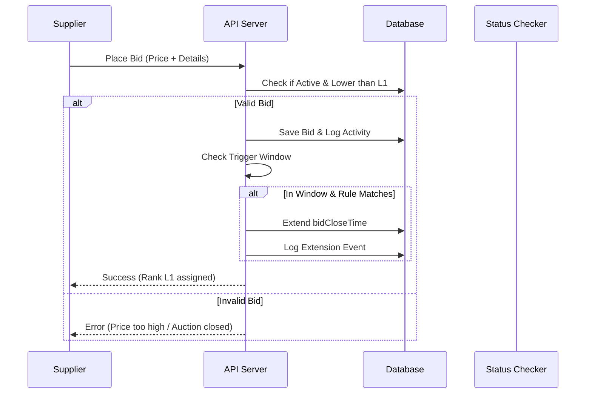
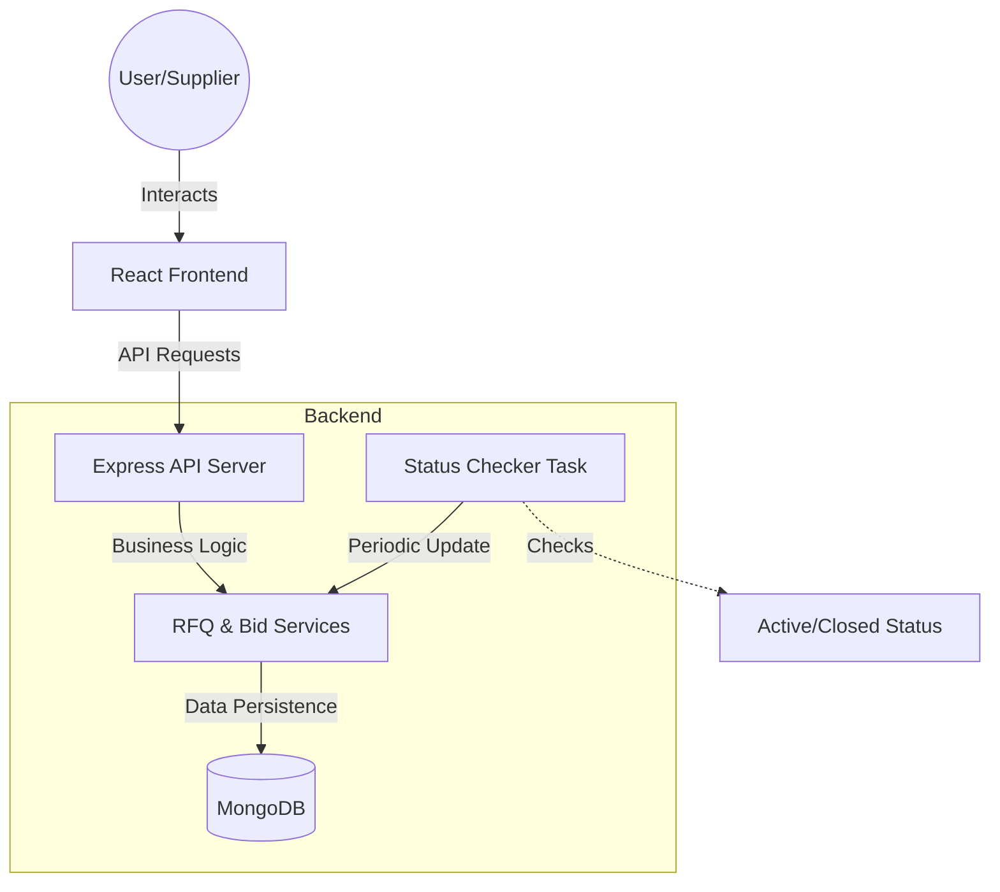
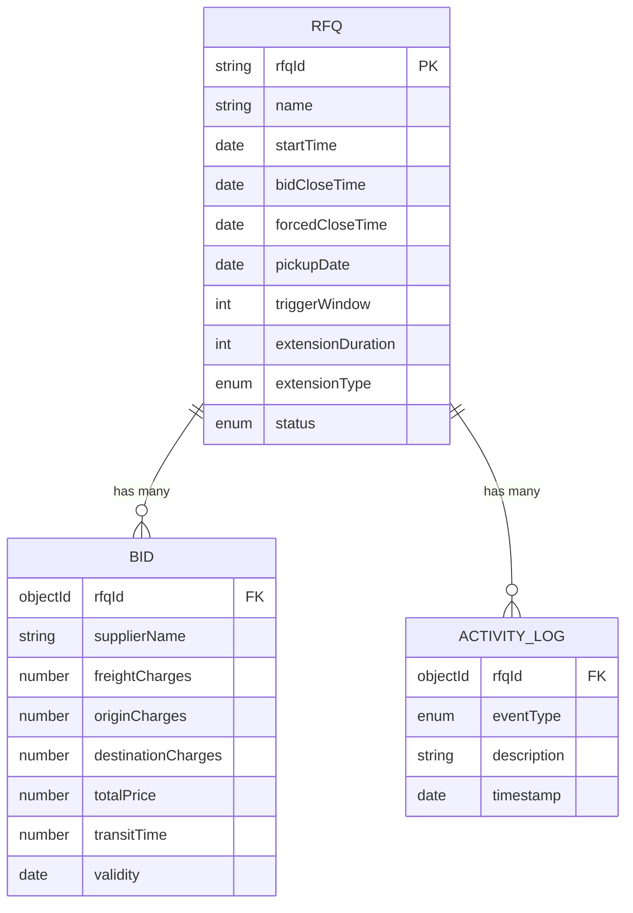

# RFQBid - British Auction RFQ System 🚀

RFQBid is a premium, real-time British Auction system designed for efficient Request for Quote (RFQ) management. It provides a seamless interface for buyers to monitor live auctions and for suppliers to place competitive bids in a dynamic environment.

[](https://frq-frontend.vercel.app/) 


## 📸 Screenshots

<div align="center">
  
</div>


## ✨ Key Features

- **Live Auction Monitoring**: Real-time updates on active auctions with countdown timers and status indicators.
- **Dynamic Bidding System**: Intuitive "Place Your Bid" interface with instant validation and submission.
- **L1 Ranking Algorithm**: Automatically calculates and highlights the lowest (L1) bidder for every RFQ.
- **Premium UI/UX**:
  - Clean, modern dashboard using the **Outfit** typography.
  - Interactive **Vertical Stats Cards** with watermark accents.
  - Smooth transitions and responsive layout (Mobile-first design).
- **Supplier Network**: Comprehensive view of supplier performance and participation.
- **Secure Access**: Integrated lock mechanisms for restricted management features.

---

## 🛠️ Technology Stack

- **Frontend**: [React.js](https://reactjs.org/) (Vite)
- **Styling**: [Tailwind CSS](https://tailwindcss.com/) & Vanilla CSS
- **Icons**: [Lucide React](https://lucide.dev/)
- **Fonts**: [Outfit](https://fonts.google.com/specimen/Outfit) (via Google Fonts)
- **Deployment**: [Vercel](https://vercel.com/)

---

## 🚀 Getting Started

### Prerequisites
- Node.js (v16 or higher)
- npm or yarn

### Installation

1. **Clone the repository**:
   ```bash
   git clone https://github.com/adityaragaai/FRQ-frontend.git
   cd FRQ-frontend
   ```

2. **Install dependencies**:
   ```bash
   npm install
   ```

3. **Set up Environment Variables**:
   Create a `.env` file in the root directory and add your backend API URL:
   ```env
   VITE_API_BASE_URL=your_backend_api_url
   ```

4. **Run the development server**:
   ```bash
   npm run dev
   ```

5. **Build for production**:
   ```bash
   npm run build
   ```

---

## 🏗️ Project Structure

```text
src/
├── components/     # Reusable UI components (Sidebar, Navbar, Stats, etc.)
├── services/       # API service layers
├── App.jsx         # Main application layout and routing
├── index.css       # Global styles and Tailwind configuration
└── main.jsx        # Application entry point
```

---


## ✨ Key Features
- **British Auction Logic**: Strict descending price requirements (bids must be lower than current L1).
- **Dynamic Auction Extensions**: Automatically extends the auction if a bid is placed within the trigger window.
- **Configurable Extension Rules**:
  - `ANY_BID`: Extends on any valid bid.
  - `RANK_CHANGE`: Extends when a supplier's rank changes.
  - `L1_CHANGE`: Extends when the lowest bid (L1) is overtaken.
- **Hard Closure**: `forcedCloseTime` ensures auctions don't extend indefinitely.
- **Real-time Ranking**: Automatic assignment of L1, L2, L3... rankings based on price and time.
- **Activity Logging**: Full audit trail of bids, ranking changes, and time extensions.

## 🛠️ Technology Stack
- **Frontend**: React, Tailwind CSS, Lucide Icons, Vite.
- **Backend**: Node.js, Express.js.
- **Database**: MongoDB (Mongoose ODM).
- **Diagrams**: Mermaid.js.

## 🔄 Bidding Flow




## 🏗️ High-Level Design (HLD)

The system follows a standard Client-Server architecture with a background worker for real-time status management.



### Core Components
1.  **Frontend**: React-based dashboard for creating RFQs and placing bids.
2.  **API Server**: Node.js/Express handling RESTful endpoints for RFQ and Bid management.
3.  **Database**: MongoDB for storing RFQ details, bid history, and activity logs.
4.  **Background Worker**: A periodic task that checks for expiring RFQs and updates their status or extends time based on rules.

---

## 🗄️ Database Schema

The system uses MongoDB with Mongoose ODM. Below is the ER Diagram representation:



### Models Detail
-   **Rfq**: Stores the configuration for each auction, including extension rules (`extensionType`: `ANY_BID`, `RANK_CHANGE`, `L1_CHANGE`).
-   **Bid**: Stores individual supplier bids. `totalPrice` is automatically calculated as the sum of all charges.
-   **ActivityLog**: Records critical events like new bids, rank changes, and auction extensions.


## 🔌 API Endpoints

| Method | Endpoint | Description |
| :--- | :--- | :--- |
| `POST` | `/api/rfq` | Create a new RFQ |
| `GET` | `/api/rfq` | Get all RFQs |
| `GET` | `/api/rfq/:id` | Get RFQ details by ID |
| `POST` | `/api/bid` | Place a new bid |
| `GET` | `/api/bid/:rfqId` | Get all bids for a specific RFQ |
| `GET` | `/api/activity/:rfqId` | Get activity logs for an RFQ |

---

## ⚙️ Auction Logic
- **British Auction**: Suppliers compete by lowering their prices.
- **Dynamic Extension**: If a bid is placed within the `triggerWindow` before closing, the `bidCloseTime` is extended by `extensionDuration`.
- **Extension Types**:
    - `ANY_BID`: Any new bid triggers an extension.
    - `RANK_CHANGE`: Extension only if the supplier's rank changes.
    - `L1_CHANGE`: Extension only if the lowest bid (L1) is overtaken.

